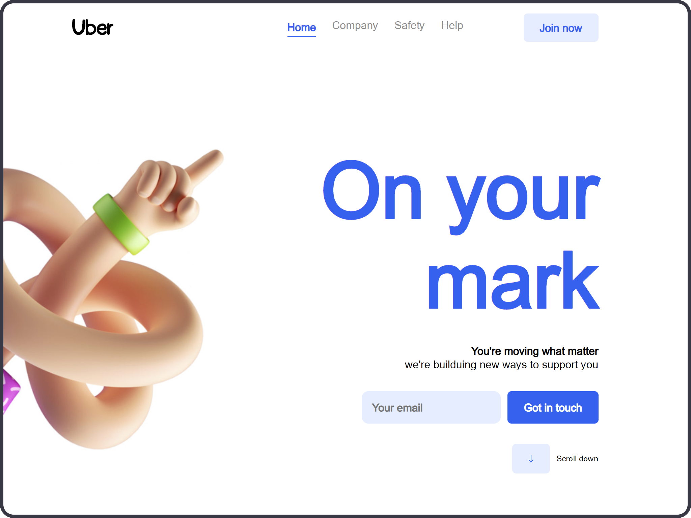

CONTENIDO
=============
 
<a href="https://sosan.github.io/control_jl_02/">WEb Github pages</a> 
<a href="https://frosty-knuth-059f03.netlify.app/">Web Netlify</a> 

# Plantilla FrontEnd
##### Plantilla Básica para poder empezar casi cualquier proyecto en **FrontEnd**.

~~~
Metodología de carpetas en FrontEnd
Estructura en imágenes (svg, jpg, iconos, etc)
Readme, licencia MIT, gitignore
Fuentes externas al OS
Semiestructuras en código
Comentarios introductorios
~~~

> Este contenido se ha creado para mís alumnos, que se inician en el maravilloso mundo de la programación.

---
###### _Copyright 2020 - Toni Ferra_

